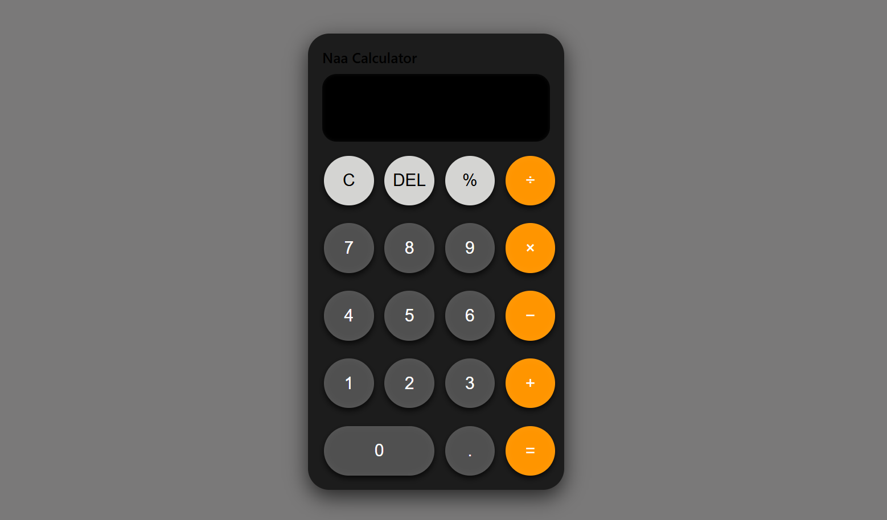

# 📱 Simple Calculator Web App

This is a simple, responsive calculator built using **HTML**, **CSS**, and **JavaScript**.  
It performs basic arithmetic operations like **Addition**, **Subtraction**, **Multiplication**, and **Division**.

## ✨ Features

- Clean and modern user interface
- Responsive design for different screen sizes
- Supports basic arithmetic operations
- Built with plain HTML, CSS, and JavaScript (no frameworks)

## 🌐 Live Website

👉 [View Calculator Live](https://calculator-project-black-eta.vercel.app/)  


## 📸 Preview



## 🚀 Technologies Used

- HTML5
- CSS3
- JavaScript

## 📌 How to Use

1. Clone the repository:
   ```bash
   git clone https://github.com/koushik286/Calculator_Project.git
